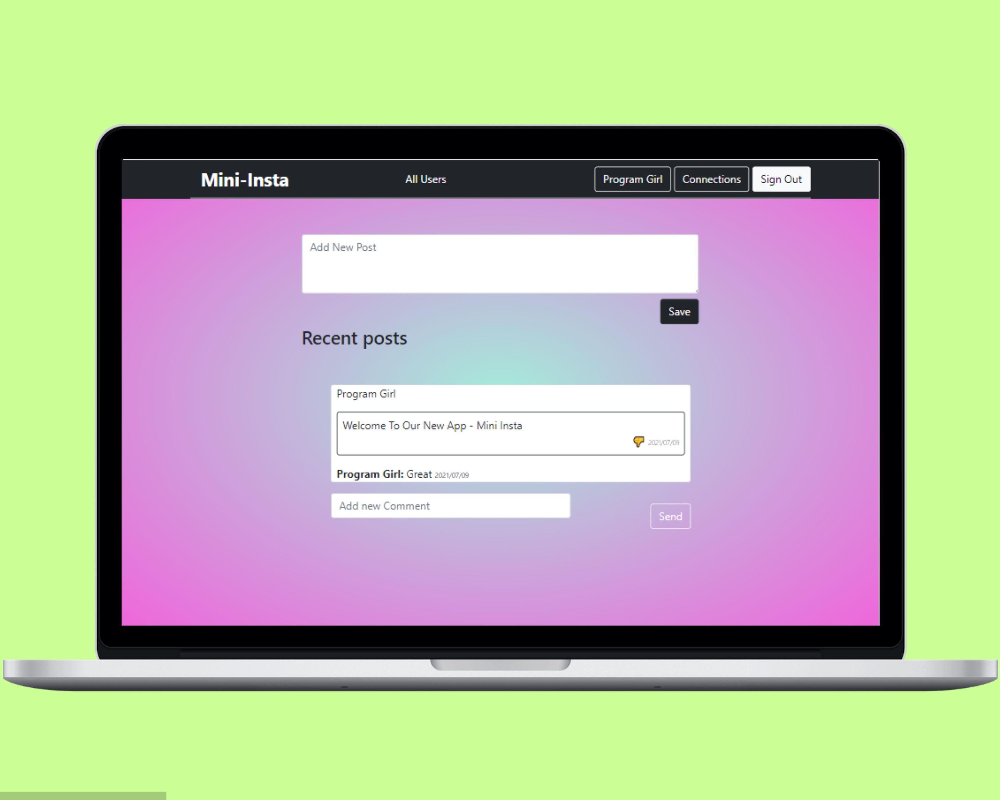

# Mini Insta

> This is a social app to chat with friends. On this you can send friend request to each other and share posts.

## Business requirements:

As a guest:
- I want to be able to create account/log in.
- I can see only “Sign in” and “Sign out” page.

As a user:
- I want to be able to see all users list.
- I want to be able to see selected user page with their user name and all posts written by them (the most recent posts on the top).
- I want to be able to send a friendship invitation.
- I want to see a button “Invite to friendship” next to the name of user who is not my friend yet - on both users’ list and single user page.
- I want to be able to see pending friendship invitations sent to me from other users.
- I want to be able to accept or reject friendships invitation.
- I want to be able to create new posts (text only).
- I want to be able to like/dislike posts (but I can like single post only once).
- I want to be able to add comments to posts.
- I want to be able to see “Timeline” page with posts (with number of likes and comments) written by me and all my friends (the most recent posts on the top).
- Timeline page should be the root page of the app.

## Built With

- <code></code> Ruby Language  
-  <code></code> Ruby on Rails  
- &nbsp; Git 
- &nbsp; GitHub 
- &nbsp; VScode

## Getting Started

### Prerequisites
- Node
- Rails
- Yarn
- Git
- Node

#### Clone this repository on to your local PC

- Click on the `Code` green button
- By the right end of the read-only input containing the repository link click the clipboard icon to copy the link
- In your local PC, open your terminal in the folder you would like to clone the repository into
- Clone the repository with the command: `git clone (copied link)`; like so: `git clone https://github.com/AbdumurodovaZulfizar/ror-social-scaffold`
- After the clone, type in the command `cd ror-socail-scaffold` to access the directory on the terminal
- Then run `bundle update` to update gem file
- And type `bundle install` to load all gems in this folder.
- After run `rails db:migrate` for migration.
- Type `rails s` on the terminal, and type `localhost:3000` on your browser.
- And then you can Sign In.

## Prerequisites
- Ruby: 2.7.0
- Rails: 5.2.3 
- Postgres: >=9.5

## To run test
- cd into ror-social-scaffold
- type `bundle exec rspec`

## Live Demo
[Mini Insta](https://arcane-island-34002.herokuapp.com/)

## Authors

👩🏻‍💼 **Zulfizar Abdumurodova**

- GitHub: [Abdumurodova Zulfizar](https://github.com/AbdumurodovaZulfizar)
- Twitter: [Abdumurodova Zulfizar](https://twitter.com/Zulfiza70357085)
- LinkedIn: [Abdumurodova Zulfizar](https://www.linkedin.com/in/zulfizar-abdumurodova-a61527206/)

## 🤝 Contributing

Contributions, issues, and feature requests are welcome!

## Show your support

Give a ⭐️ if you like this project!

## Acknowledgments

- [Microverse](https://www.microverse.org/) for international opportunities.
- Special thanks to all code reviewers.
- AppAcademy and FreeCodeCamp for their open source

## 📝 License

Copyright 2021 Zulfizar Abdumurodova
- [MIT](https://github.com/AbdumurodovaZulfizar/ror-social-scaffold/blob/milestone_six/LICENSE) for this project.